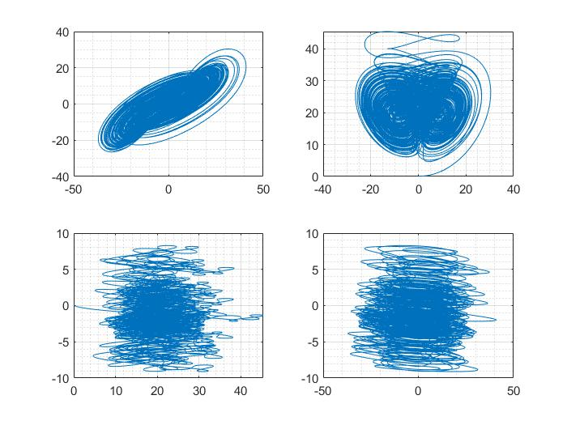
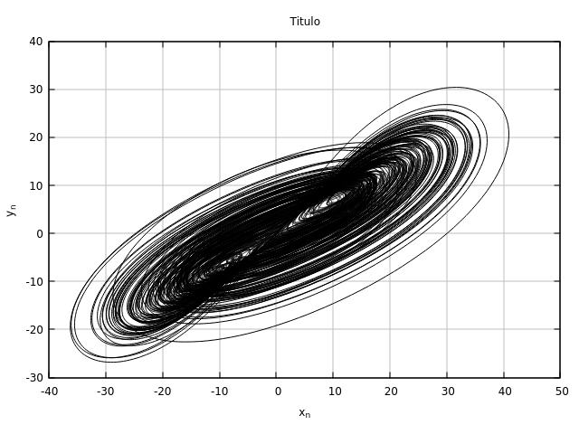

# Sundarapandian system


## System dynamics

$$
\begin{array}{lcl}
		\dot{y_{1}} & = & a(y_{2}-y_{1}) + y_{2}y_{3} + dy_{4} \\
		\dot{y_{2}} & = & -y_{1} + b y_{2} - y_{1}y_{3} + dy_{4}\\
		\dot{y_{3}} & = & y_{2}^2 - c y_{3} \\
		\dot{y_{4}} & = & -y_{2}\\
\end{array}
		\label{ec:sundar}
$$

## Forward Euler equation for the system

The forward Euler method is as follows:
$$
y_{n+1} = y_{n} + h f(x_{n},y_{n})
$$
For convinience we do the following substitutions:
$$
\begin{array}{lcl}
		y_{1} & = &  w\\
		y_{2} & = &  x\\
		y_{3} & = &  y\\
		y_{4} & = &  z\\
\end{array}
%% y_{1} = w \qquad y_{2} = x \qquad y_{3} = y \qquad y_{4} = z
$$
The resulting system is:
$$
\begin{array}{lcl}
		w_{n+1} & = & w_{n} + h [ a(x_{n}-w_{n}) + x_{n}y_{n} + dz_{n} ]  \\
		x_{n+1} & = & x_{n} + h [-w_{n} + b x_{n} - w_{n}y_{n} + dz_{n}] \\
		y_{n+1} & = & y_{n} + h [x_{n}^2 - c y_{n}]  \\
		z_{n+1} & = & z_{n} + h [-x_{n}] \\
\end{array}
		\label{ec:sundar_euler}
$$
where
$$
\begin{array}{lcl}
		a & = &  40\\
		b & = &  28\\
		c & = &  4\\
		d & = &  7\\
\end{array}
$$
and the initial conditions are 
$$
\begin{array}{lcl}
		w_{0} & = &  0.1\\
		x_{0} & = &  0.1\\
		y_{0} & = &  0.1\\
		z_{0} & = &  0.1\\
\end{array}
$$
We need adders, subtracters, multipliers, multiplexers, registers and  CU.


## MATLAB simulation with forward Euler

### 1. Simulación básica de sistema

```matlab
clear; close all; clc;
tic
h = 0.001;     % Tamanio de paso
t = 0:h:10000; % Vector de tiempo

a = 40; b = 28; c = 4; d = 7;	% Parametros
y1 = zeros(size(t));   			% Inicializacion de los vectores
y2 = zeros(size(t));
y3 = zeros(size(t));
y4 = zeros(size(t));
% Asignacion de condicion inicial
ini_cond = [0.1 0.1 0.1 0.1]';	% Condiciones iniciales
y1(1) = ini_cond(1);
y2(1) = ini_cond(2);
y3(1) = ini_cond(3);
y4(1) = ini_cond(3);
% Algoritmo forward euler
for i = 2:size(y1,2)
    y1(i) = y1(i-1) + y1_state(y1(i-1),y2(i-1),y3(i-1),y4(i-1),a,b,c,d)*h;
    y2(i) = y2(i-1) + y2_state(y1(i-1),y2(i-1),y3(i-1),y4(i-1),a,b,c,d)*h;
    y3(i) = y3(i-1) + y3_state(y1(i-1),y2(i-1),y3(i-1),y4(i-1),a,b,c,d)*h;
    y4(i) = y4(i-1) + y4_state(y1(i-1),y2(i-1),y3(i-1),y4(i-1),a,b,c,d)*h;
end

subplot(2,2,1); plot(y1,y2); grid on; grid minor;
subplot(2,2,2); plot(y2,y3); grid on; grid minor;
subplot(2,2,3); plot(y3,y4); grid on; grid minor;
subplot(2,2,4); plot(y1,y4); grid on; grid minor;

check_max = [max(y1) max(y2) max(y3) max(y4)];
check_min = [min(y1) min(y2) min(y3) min(y4)];
check_max = max(check_max)
check_min = min(check_min)

toc
% Descripcion de sistema dinamico
function R = y1_state(y1,y2,y3,y4,a,b,c,d)
    R = a*(y2-y1) + y2*y3 + d*y4;
end

function R = y2_state(y1,y2,y3,y4,a,b,c,d)
    R = -y1 + b*y2 - y1*y3 + d*y4;
end

function R = y3_state(y1,y2,y3,y4,a,b,c,d)
    R = y2*y2 - c*y3;
end

function R = y4_state(y1,y2,y3,y4,a,b,c,d)
    R = -y2;
end
```

De la simulación podemos notar que los límites absolutos son  [-37.0094636606145 , 45.4266030729233], y un buen tamaño de paso es h = 0.001.



Desafortunadamente analizar unicamente las variables de estado para seleccionar el número de bits para la parte entera no es suficiente, es necesario realizar un análisis más profundo.

## 2. Simulación para determinar punto fijo

```matlab
clear; close all; clc;
tic
h = 0.001;     % Tamanio de paso

% Parametros
a = 40; b = 28; c = 4; d = 7;

% Vectores 
y1 = []; y2 = []; y3 = []; y4 = []; data = [];

% Asignacion de condicion inicial
y1(1) = 0.1; y2(1) = 0.1; y3(1) = 0.1; y4(1) = 0.1;

% Algoritmo forward euler
for i = 1:100001
    op11 = y2(i)-y1(i);         
    op12 = a*op11;             
    op13 = y2(i)*y3(i);         
    op14 = op12 + op13;         
    op15 = d*y4(i);             
    op16 = op14 + op15;         
    op17 = op16*h;              
    y1(i+1) = y1(i) + op17;     
    
    op21 = d*y4(i);
    op22 = op21 - y1(i);
    op23 = b*y2(i);
    op24 = y1(i)*y3(i);
    op25 = op23 - op24;
    op26 = op25 + op22;
    op27 = op26*h;
    y2(i+1) = y2(i) + op27;

    op31 = y2(i)*y2(i);
    op32 = c*y3(i); 
    op33 = op31 - op32;
    op34 = op33*h;
    y3(i+1) = y3(i) + op34;

    op41 = y2(i)*h;
    y4(i+1) = y4(i) - op41;

    data(i,:) = [y1(i+1),y2(i+1),y3(i+1),y4(i+1),op11,op12,op13,op14,op15,op16,op17,op21,op22,op23,op24,op25,op26,op27, op31,op32,op33,op34, op41];
end

f = figure; f.Position(1:2) = [800 800]; % [right bottom]
subplot(2,2,1); plot(y1,y2); grid on; grid minor;
subplot(2,2,2); plot(y2,y3); grid on; grid minor;
subplot(2,2,3); plot(y3,y4); grid on; grid minor;
subplot(2,2,4); plot(y1,y4); grid on; grid minor;
check_max = max(data,[],'all')
check_min = min(data,[],'all')
toc
```

Calculamos el máximo y el mínimo en cada una de las operaciones, [-1546.4540912767,1583.57210518208], con esta información ya podemos seleccionar el número de bits de la parte entera, el cual se comprobará en la simulación en C.


## Diagrama a bloques del sistema 


## Fixed point analysis

| Variable | Number of bits | Format     | Move point | Range $[-2^{a},2^{a}-2^{-b}]$ |
| -------- | -------------- | ---------- | ---------- | ----------------------------- |
| $X$      | $32$ bits      | $X(11,20)$ | $20$       | $[-64,63.9999999701977]$      |


## Simulación en C

```c
/*
    Autor:  Ciro Fabian Bermudez Marquez
    Nombre: Simulador de diseños en VHDL de 64 bits en punto fijo
    Agracecimientos: Dr. Luis Gerardo de la Fraga y Dr. Cuauhtemoc Mancillas López
*/
#include <stdio.h>
#include <stdlib.h>
#include <math.h>
#include <string.h>

/* Variables globales */
int _a;                       // parte entera
int _b;                       // parte fraccionaria
long _power;


/*
    Para un Ryzen 5 3600 en MxLinux
    
    Data type <int> tiene 4 bytes, es decir 32 bits.
    printf("int is %lu bytes.\n",sizeof(int));
    
    Data type <short> tiene 2 bytes, es decir 16 bits.
    printf("short is %lu bytes.\n",sizeof(short));
    
    Para compilar ejecutar:
        gcc -o cordic cordic.c - lm
*/

void inicializa( int a, int b ){        
    _a = a;                             // A(a,b) representacion en punto fijo, cargamos variables globables 
    _b = b;
    _power = 1L << _b;                  // Calculamos el factor para la conversion
}


long setNumber( double v ){              // Convierte a punto fijo con truncamiento 
    return ( (long)(v*_power) );
}

double getNumber( long r ){              // Convierte de vuelta a double
    return ( (double)r/_power);
}


long multTrunc( long x, long y ){          // Multiplicacion con truncamiento
    __int128 r;
    __int128 a=0;
    __int128 b=0;
    a = x;
    b = y;
    r = a*b;
    r = r >> _b;
    return( r );
}


int main(int argc, char *argv[]){

    // Archivo de texto
    FILE *fpointer = fopen("salida.txt","w");
    
    int entera;                     
    int frac;
    int i;

    long y1_n,y2_n,y3_n,y4_n;        // Variables para algoritmo
    long y1_ni,y2_ni,y3_ni,y4_ni;
    long hf;
    long ap,bp,cp,dp;         		// Parametros del sistema
    
    double y1_0,y2_0,y3_0,y4_0,h;    // Variables para condiciones iniciales
    
    
    // Parametros de punto fijo
    entera = 11; // 20
    frac = 52; // 43
    inicializa( entera, frac );
    printf(" Representacion A(a,b) = A(%d,%d)\n a: entera\tb: fraccionaria\n",entera,frac);

    // Valores iniciales
    y1_0 = 0.1;
    y2_0 = 0.1;
    y3_0 = 0.1;
    y4_0 = 0.1;
    h    = 0.001;
    
    printf(" # y1_0: %f\n", y1_0 );
    printf(" # y2_0: %f\n", y2_0 );
    printf(" # y3_0: %f\n", y3_0 );
    printf(" # y4_0: %f\n", y4_0 );
    printf(" #    h: %f\n", h );
    
    // Conversion a punto fijo
    y1_n = setNumber( y1_0 );
    y2_n = setNumber( y2_0 );
    y3_n = setNumber( y3_0 );
    y4_n = setNumber( y4_0 );
      hf = setNumber(    h );
    printf(" # y1_0 real: %2.10f\n",getNumber(y1_n) );
    printf(" # y2_0 real: %2.10f\n",getNumber(y2_n) );
    printf(" # y3_0 real: %2.10f\n",getNumber(y3_n) );
    printf(" # y4_0 real: %2.10f\n",getNumber(y4_n) );
    printf(" #    h real: %2.10f\n",getNumber(  hf) );
    
    
    // Parametros del sistema
    ap = setNumber( 40.0 );
    bp = setNumber( 28.0 );
    cp = setNumber( 4.0 );
    dp = setNumber( 7.0 );

    
    //fprintf(fpointer,"%2.20f\t%2.20f\t\t%lx\t\t%lx\n",getNumber( y1_n ), getNumber( y2_n ) , y1_n, y2_n);
    fprintf(fpointer,"%2.20f\t%2.20f\n",getNumber( y1_n ), getNumber( y2_n ));
    for(i = 0; i<10000000; i++){

        y1_ni = y1_n  + multTrunc(hf,multTrunc( ap, y2_n - y1_n ) + multTrunc(y2_n, y3_n) + multTrunc( dp, y4_n));
        y2_ni = y2_n  + multTrunc(hf, - y1_n + multTrunc( bp, y2_n ) - multTrunc( y1_n ,y3_n ) + multTrunc( dp, y4_n));
        y3_ni = y3_n  + multTrunc(hf, multTrunc( y2_n , y2_n ) - multTrunc( cp, y3_n));
        y4_ni = y4_n  + multTrunc(hf, - y2_n);
        
        
        y1_n = y1_ni;
        y2_n = y2_ni;
        y3_n = y3_ni;
        y4_n = y4_ni;     

        //fprintf(fpointer,"%2.20f\t%2.20f\t\t%lx\t\t%lx\n",getNumber( y1_ni ), getNumber( y2_ni ),y2_ni,y2_ni);
        fprintf(fpointer,"%2.20f\t%2.20f\n",getNumber( y1_n ), getNumber( y2_n ));
    }
    
    fclose(fpointer);
    return 0;
}
// gcc -o simulation simulation.c
// ./simulation 
// gnuplot -e "filename='salida.txt'" graph.gnu
```





## VDHL codes

A continuación se muestran todos los bloques:

```vhdl
library ieee;
use ieee.std_logic_1164.all;			   

entity mux is
	generic( n : integer := 64);  -- Tamanio de palabra
	port(
        X0	: in std_logic_vector(n-1 downto 0);
        Xn_1: in std_logic_vector(n-1 downto 0);	   
        SEL	: in std_logic;
        Xn	: out std_logic_vector(n-1 downto 0)
	);
end;	 		  

architecture arch of mux is
begin
	Xn <= X0 when SEL = '0' else Xn_1;
end arch;
```

**Código: mux.vhd**


```vhdl
library ieee;
use ieee.std_logic_1164.all;

entity ff_gen_hab is
	generic(n : integer := 64);
	port(
		RST	:	in	std_logic;
		CLK	:	in	std_logic; 
		HAB	:	in	std_logic_vector(1 downto 0);
		D	:	in	std_logic_vector(n-1 downto 0);
		Q	:	out	std_logic_vector(n-1 downto 0)
	);	
end;

architecture ff of ff_gen_hab is
signal Qn, Qp : std_logic_vector(n-1 downto 0);
begin		 
--	Qn <= Qp when HAB = '0' else D;	 
	with HAB select
	Qn <=  	                 (others => '0') when "00",	  -- Reset
										   D when "01",	  -- Pasar
										  Qp when others; -- Mantener
	process(RST, CLK)
	begin
		if RST = '1' then
			Qp <= (others => '0');
		elsif rising_edge(CLK) then
			Qp <= Qn;
		end if;
	end process; 
	Q <= Qp;
end ff;
```

**Código: ff_gen_hab.vhd**


```vhdl
library ieee;
use ieee.std_logic_1164.all;
use ieee.numeric_std.all;

entity mult is
	generic( n	:	integer := 64);
	port(
		A	: in	std_logic_vector(n-1 downto 0);
		B	: in	std_logic_vector(n-1 downto 0);
		M	: out	std_logic_vector(n-1 downto 0)
	);
end;	

architecture aritmetica of mult is
signal temp : std_logic_vector(2*n-1 downto 0);			   -- La parte fraccionaria es de 60 bits		3,60
begin	
    temp <= std_logic_vector(signed(A)*signed(B));
	M <= temp(123 downto 60);
end aritmetica;										
```

**Código: mult.vhd**


```vhdl
library ieee;
use ieee.std_logic_1164.all;
use ieee.numeric_std.all;

entity sum is
	generic( n : integer := 64 );
	port(
        T1,T2	 : in   std_logic_vector(n-1 downto 0);
        S1	     : out  std_logic_vector(n-1 downto 0) 
	);
end;	

architecture aritmetica of sum is
begin	
	S1 <= std_logic_vector( signed(T1) + signed(T2) );
end aritmetica;										
```

**Código: sum.vhd**


```vhdl
library ieee;
use ieee.std_logic_1164.all;
use ieee.numeric_std.all;

entity sum4a1 is
	generic( n : integer := 64 );
	port(
        T1,T2,T3,T4			 : in   std_logic_vector(n-1 downto 0);
        S1	                 : out  std_logic_vector(n-1 downto 0) 
	);
end;	

architecture aritmetica of sum4a1 is
begin	
	S1 <= std_logic_vector( signed(T1) + signed(T2) + signed(T3) + signed(T4));
end aritmetica;										
```

**Código: sum4a1.vhd**


```vhdl
library ieee;
use ieee.std_logic_1164.all;

entity rom is
	generic( n : integer := 64 ); 		 -- tamaño de palabra
	port(
		an_1,an_2,an_3,an_4    :	out	std_logic_vector(n-1 downto 0);
		an_5,an_6,an_7,an_8    :	out	std_logic_vector(n-1 downto 0);
		an_9,an_10,an_11,an_12 :	out	std_logic_vector(n-1 downto 0)
	);	
end rom;					 

architecture arch of rom is
begin	  	
     an_1 <= "1111011001100110011001100110011001100110011001100110011010000000";	 -- -0.6 
	 an_2 <= "1111111001100110011001100110011001100110011001100110011001100000";	 -- -0.1 
	 an_3 <= "0001000110011001100110011001100110011001100110011001101000000000";	 -- 1.1 
	 an_4 <= "0000001100110011001100110011001100110011001100110011001101000000";	 -- 0.2 
	 an_5 <= "1111001100110011001100110011001100110011001100110011001100000000";	 -- -0.8 
	 an_6 <= "0000100110011001100110011001100110011001100110011001100110000000";	 -- 0.6 
	 an_7 <= "1111010011001100110011001100110011001100110011001100110100000000";	 -- -0.7 
	 an_8 <= "0000101100110011001100110011001100110011001100110011001100000000";	 -- 0.7 
	 an_9 <= "0000101100110011001100110011001100110011001100110011001100000000";	 -- 0.7 
	 an_10 <= "0000010011001100110011001100110011001100110011001100110011000000";	 -- 0.3 
	 an_11 <= "0000100110011001100110011001100110011001100110011001100110000000";	 -- 0.6 
	 an_12 <= "0000111001100110011001100110011001100110011001100110011010000000";	 -- 0.9 
end arch;
```

**Código: rom.vhd**


```vhdl
library ieee;
use ieee.std_logic_1164.all;

entity cu2 is
  port(
    RST     : in   std_logic;
    CLK     : in   std_logic;
    START   : in   std_logic;
    HAB     : out  std_logic_vector(1 downto 0);
    SEL     : out  std_logic
  );
end;

architecture fsm of cu2 is
    signal Qp, Qn  : std_logic_vector(1 downto 0); -- porque son 6 estados
begin
  
  process(Qp,START) 
  begin
    case Qp is
     when "00" => SEL <= '0'; HAB <= "00";           -- espera 1 
        if START = '1' then 
          Qn <= "01";
        else 
          Qn <= Qp;
        end if;
     when "01" => SEL <= '0'; HAB <= "01";           -- habilita 1         
          Qn <= "10";
     when "10" => SEL <= '1'; HAB <= "11";           -- espera 2
        if START = '1' then 
          Qn <= "11";
        else 
          Qn <= Qp;
        end if;
     when "11" => SEL <= '1'; HAB <= "01";            -- habilita 2
        Qn <= "10";
     when others => SEL <= '0';  HAB <= "11";         -- default
        Qn <= "00";
    end case;
  end process;

  -- Registros para estados
  process(RST,CLK)
  begin
    if RST = '1' then
      Qp <= (others => '0');
    elsif rising_edge(CLK) then
      Qp <= Qn;
    end if;
  end process;

end fsm;
```

**Código: cu2.vhd**


```vhdl
library ieee;
use ieee.std_logic_1164.all;			   

entity mapa_sprott2 is
	generic( n : integer := 64); -- Tamanio de palabra
	port(
        CLK     : in  std_logic;
        RST     : in  std_logic;
        START   : in std_logic;
        X0	    : in  std_logic_vector(n-1 downto 0);
        Y0      : in  std_logic_vector(n-1 downto 0);	   
        Xn_p	: out std_logic_vector(n-1 downto 0);
        Yn_p    : out  std_logic_vector(n-1 downto 0)
	);
end;	 		  

architecture arch of mapa_sprott2 is
    signal xn, yn, xn_retro, yn_retro : std_logic_vector(n-1 downto 0);
    signal sel : std_logic;
	signal hab : std_logic_vector(1 downto 0);
    signal an_1,an_2,an_3,an_4,an_5,an_6,an_7,an_8,an_9,an_10,an_11,an_12 : std_logic_vector(n-1 downto 0);
	signal m1,m2,m3,m4,m5    : std_logic_vector(n-1 downto 0); 
	signal s1,s2,s3,s4,s5,s6 : std_logic_vector(n-1 downto 0); 
	signal t2,t3,t4 		 : std_logic_vector(n-1 downto 0); 
	signal t2p,t3p,t4p 		 : std_logic_vector(n-1 downto 0); 
begin
    -- Mux
	mux_x	: entity work.mux    generic map(n => 64) port map(X0,xn_retro,sel,xn);		   -- listo
	mux_y	: entity work.mux    generic map(n => 64) port map(Y0,yn_retro,sel,yn);		   -- listo
	
	-- ROM	
	rom_mod : entity work.rom generic map(n => 64) port map(an_1,an_2,an_3,an_4,an_5,an_6,an_7,an_8,an_9,an_10,an_11,an_12); -- listo
	
	--Bloque 1
	mult_m1 : entity work.mult   generic map(n => 64) port map(an_3,xn,m1);			 -- listo
	sum_s1	: entity work.sum    generic map(n => 64) port map(m1,an_2,s1);			 --	listo
	mult_t2 : entity work.mult   generic map(n => 64) port map(s1,xn,t2);			 -- listo	
	
	--Bloque 2
	mult_m2 : entity work.mult   generic map(n => 64) port map(an_6,yn,m2);			 -- listo
	sum_s2	: entity work.sum    generic map(n => 64) port map(m2,an_5,s2);			 --	listo
	mult_t4 : entity work.mult   generic map(n => 64) port map(s2,yn,t4);			 -- listo	
	
	--Bloque 3
	mult_m5  : entity work.mult   generic map(n => 64) port map(xn,yn,m5);			 -- listo
	mult_t3  : entity work.mult   generic map(n => 64) port map(an_4,m5,t3);		 -- listo
	mult_t3p : entity work.mult   generic map(n => 64) port map(m5,an_10,t3p);		 -- listo
			
	--Bloque 4
	mult_m3  : entity work.mult   generic map(n => 64) port map(an_9,xn,m3);		 -- listo
	sum_s3	 : entity work.sum    generic map(n => 64) port map(m3,an_8,s3);		 --	listo
	mult_t2p : entity work.mult   generic map(n => 64) port map(s3,xn,t2p);			 -- listo	
	
	--Bloque 5
	mult_m4  : entity work.mult   generic map(n => 64) port map(an_12,yn,m4);		 -- listo
	sum_s4	 : entity work.sum    generic map(n => 64) port map(m4,an_11,s4);		 --	listo
	mult_t4p : entity work.mult   generic map(n => 64) port map(s4,yn,t4p);			 -- listo		
	
	--Bloque 6
	sum_s5   : entity work.sum4a1 generic map(n => 64) port map(an_1,t2,t3,t4,s5);	 --	listo
	ff_xn    : entity work.ff_gen_hab    generic map(n => 64) port map(RST,CLK,hab,s5,xn_retro);
	
	--Bloque7
	sum_s6   : entity work.sum4a1 generic map(n => 64) port map(an_7,t2p,t3p,t4p,s6);  -- listo
	ff_yn    : entity work.ff_gen_hab     generic map(n => 64) port map(RST,CLK,hab,s6,yn_retro);

	
	Xn_p <= xn_retro;	
	Yn_p <= yn_retro;	  

	-- Control Unit
	cu_mod  : entity work.cu2  port map(RST,CLK,START,hab,sel);
	
end arch;
```

**Código: top.vhd**


## Analisis de SCM (Single constant multiplication)

h = 0.01 


## Notas personales

* Para poder realizar verdaderamente un analisis de punto fijo del sistema es necesario analizar operación por operación para descubrir cuales son los límites máximos y mínimos, además de eso ejecutar el programa un tiempo razonable, no basta con analizar los límites de las variables de estado, por esta razón modifique el programa de análisis de punto fijo de matlab, además, noté que cambiar el orden de las operaciones modifica ligeramente el atractor, afortunadamente no su cualidad de ser caótico, por lo anterior también se modifican los límites máximos y mínimos ligeramente. Una vez determinados los límites se selecciona el mínimo número de bits para la parte entera, en este caso particular el límite es |1583| por lo tanto se seleccionaron 11 bits para la parte entera, la parte fraccionaria se elige seleccionando una arquitectura, de 16, 32 o 64 bits y despues restando la parte entera y el bit de signo a la arquitectura seleccionada. Esto es conveniente porque nos permite hacer una simulación en C antes de saltar a la descripción de VHDL y evitar perder tiempo buscando errores. Se pueden cometer errores de sintaxis, los cuales se solucionan facilmente pero no errores de diseño.
* 
