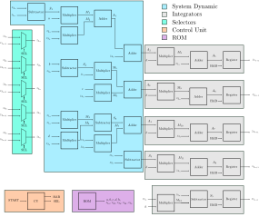

# Sundarapandian system2


## Sistema dinamico

$$
\begin{array}{lcl}
		\dot{z_{1}} & = & a(z_{2}-z_{1}) + z_{2}z_{3} + z_{4} \\
		\dot{z_{2}} & = & z_{1}(b - z_{3}) + cz_{4}\\
		\dot{z_{3}} & = & z_{1}^{2} + z_{1}z_{2} -d z_{3} \\
		\dot{z_{4}} & = & -z_{2} + z_{5}\\
		\dot{z_{5}} & = & -z_{5}\\
\end{array}
		\label{ec:sundar2}
$$

## Forward Euler ecuación para el sistema

El método de forward Euler es el siguiente:
$$
y_{n+1} = y_{n} + h f(x_{n},y_{n})
$$
El sistema resultante es:
$$
\begin{array}{lcl}
		z_{1_{n+1}} & = & z_{1_{n}} + h [ a(z_{2_{n}}-z_{1_{n}}) + z_{2_{n}}z_{3_{n}} + z_{4_{n}}  ]  \\
		z_{2_{n+1}} & = & z_{2_{n}} + h [ z_{1_{n}}(b - z_{3_{n}}) + cz_{4_{n}} ] \\
		z_{3_{n+1}} & = & z_{3_{n}} + h [ z_{1_{n}}^{2} + z_{1_{n}}z_{2_{n}} -d z_{3_{n}} ]  \\
		z_{4_{n+1}} & = & z_{4_{n}} + h [ -z_{2_{n}} + z_{5_{n}} ] \\
		z_{5_{n+1}} & = & z_{5_{n}} + h [ -z_{5_{n}} ] \\
\end{array}
	\label{ec:sundar_euler2}
$$
donde:
$$
\begin{array}{lcl}
		a & = &  40.0\\
		b & = &  90.0\\
		c & = &  16.0\\
		d & = &  15.0\\
\end{array}
$$
y las condiciones iniciales son:
$$
\begin{array}{lcl}
		z_{1_{0}} & = &  1.0\\
		z_{2_{0}} & = &  1.0\\
		z_{3_{0}} & = &  1.0\\
		z_{4_{0}} & = &  1.0\\
		z_{5_{0}} & = &  1.0\\
\end{array}
$$
___

## Simulación de MATLAB con forward Euler

### 1. Simulación básica de sistema

```matlab
clear; close all; clc;
tic
h = 0.0001;   % Tamanio de paso   0.0003
t = 0:h:15;   % Vector de tiempo

% Parametros
a = 40.0; b = 90.0; c = 16.0; d = 15.0;

z1 = zeros(size(t));   % Inicializacion de los vectores
z2 = zeros(size(t));
z3 = zeros(size(t));
z4 = zeros(size(t));
z5 = zeros(size(t));

% Asignacion de condicion inicial
ini_cond = [1.0 1.0 1.0 1.0 1.0]';    % Condiciones iniciales
z1(1) = ini_cond(1);
z2(1) = ini_cond(2);
z3(1) = ini_cond(3);
z4(1) = ini_cond(4);
z5(1) = ini_cond(5);

% Algoritmo forward euler
for i = 2:size(z1,2)
    z1(i) = z1(i-1) + z1_state(z1(i-1),z2(i-1),z3(i-1),z4(i-1),z5(i-1),a,b,c,d)*h;
    z2(i) = z2(i-1) + z2_state(z1(i-1),z2(i-1),z3(i-1),z4(i-1),z5(i-1),a,b,c,d)*h;
    z3(i) = z3(i-1) + z3_state(z1(i-1),z2(i-1),z3(i-1),z4(i-1),z5(i-1),a,b,c,d)*h;
    z4(i) = z4(i-1) + z4_state(z1(i-1),z2(i-1),z3(i-1),z4(i-1),z5(i-1),a,b,c,d)*h;
    z5(i) = z5(i-1) + z5_state(z1(i-1),z2(i-1),z3(i-1),z4(i-1),z5(i-1),a,b,c,d)*h;
end

% f = figure; f.Position(1:2) = [800 800]; % [right bottom]
subplot(2,2,1); plot(z1,z2); grid on; grid minor;
subplot(2,2,2); plot(z2,z3); grid on; grid minor;
subplot(2,2,3); plot(z3,z4); grid on; grid minor;
subplot(2,2,4); plot(z1,z4); grid on; grid minor;

check_max = max( [max(z1) max(z2) max(z3) max(z4)] )
check_min = min( [min(z1) min(z2) min(z3) min(z4)] )
toc

% Descripcion de sistema dinamico
function R = z1_state(z1,z2,z3,z4,z5,a,b,c,d)
    R = a*(z2-z1) + z2*z3 + z4;
end

function R = z2_state(z1,z2,z3,z4,z5,a,b,c,d)
    R = z1*(b-z3) + c*z4;
end

function R = z3_state(z1,z2,z3,z4,z5,a,b,c,d)
    R = z1*z1 + z1*z2 - d*z3;
end

function R = z4_state(z1,z2,z3,z4,z5,a,b,c,d)
    R = -z2 + z5;
end

function R = z5_state(z1,z2,z3,z4,z5,a,b,c,d)
    R = -z4;
end
```

De la simulación podemos notar que los límites absolutos son  [-113.7989 , 279.0923], y un buen tamaño de paso es h = 0.0001.


Desafortunadamente analizar unicamente las variables de estado para seleccionar el número de bits para la parte entera no es suficiente, es necesario realizar un análisis más profundo.

## 2. Simulación para determinar punto fijo

```matlab
clear; close all; clc;
tic
h = 0.0001;     % Tamanio de paso

% Parametros
a = 40.0; b = 90.0; c = 16.0; d = 15.0;

z1 = []; z2 = []; z3 = []; z4 = []; z5 = []; data = [];
% Asignacion de condicion inicial
ini_cond = [1.0 1.0 1.0 1.0 1.0]';    % Condiciones iniciales
z1(1) = ini_cond(1);
z2(1) = ini_cond(2);
z3(1) = ini_cond(3);
z4(1) = ini_cond(4);
z5(5) = ini_cond(5);

% Algoritmo forward euler
for i = 1:100000
    % Operacioness 
    op11 = z2(i)-z1(i);         
    op12 = a*op11;              
    op13 = z2(i)*z3(i);         
    op14 = op12 + op13;        
    op15 = op14 + z4(i);        
    op16 = op15*h;              
    z1(i+1) = z1(i) + op16;     % Listo
    
    op21 = b - z3(i);
    op22 = op21*z1(i);
    op23 = c*z4(i);
    op24 = op22 + op23;
    op25 = op24*h;              
    z2(i+1) = z2(i) + op25;     % Mas grandes las operaciones

%     op31 = z1(i)*z1(i);
%     op32 = z1(i)*z2(i); 
%     op33 = op31 + op32;
%     op34 = d*z3(i);
%     op35 = op33 - op34;
%     op36 = op35*h;
%     z3(i+1) = z3(i) + op36;    % Mas grandes las operaciones

    op31 = z1(i)*z1(i);
    op32 = d*z3(i);
    op33 = op31 - op32;
    op34 = z1(i)*z2(i); 
    op35 = op33 + op34;
    op36 = op35*h;
    z3(i+1) = z3(i) + op36;    % listo

    op41 = z5(i) - z2(i);
    op42 = op41*h;
    z4(i+1) = z4(i) + op42;  % Listo

    op51 = z5(i)*h;
    z5(i+1) =z5(i) - op51;

    data(i,:) = [z1(i+1),z2(i+1),z3(i+1),z4(i+1),z5(i+1),op11,op12,op13,op14,op15,op16,op21,op22,op23,op24,op25,op31,op32,op33,op34,op35,op36,op41,op42,op51];
    %fprintf("%f,%f,%f,%f,%f,%f,%f,%f,%f,%f,%f,%f,%f,%f,%f,%f,%f,%f,%f,%f,%f,%f,%f,%f,%f\n",z1(i+1),z2(i+1),z3(i+1),z4(i+1),z5(i+1),op11,op12,op13,op14,op15,op16,op21,op22,op23,op24,op25,op31,op32,op33,op34,op35,op36,op41,op42,op51);
end

% f = figure; f.Position(1:2) = [800 800]; % [right bottom]
subplot(2,2,1); plot(z1,z2); grid on; grid minor;
subplot(2,2,2); plot(z2,z3); grid on; grid minor;
subplot(2,2,3); plot(z3,z4); grid on; grid minor;
subplot(2,2,4); plot(z1,z4); grid on; grid minor;

check_max = max(data,[],'all')
check_min = min(data,[],'all')

toc
% text = ["z1(i+1)","z2(i+1)","z3(i+1)","z4(i+1)","z5(i+1)","op11","op12","op13","op14","op15","op16","op21","op22","op23","op24","op25","op31","op32","op33","op34","op35","op36","op41","op42","op51"];
% data = [text ; data];
% csvwrite("test.csv",data)
```

Calculamos el máximo y el mínimo en cada una de las operaciones, [-23,952.5887, 23,486.5526926225], con esta información ya podemos seleccionar el número de bits de la parte entera, $2^{15} = 32768$, después realizaremos una simulación en C para comprobar la arquitectura.


## Diagrama a bloques del sistema 



## Fixed point analysis

| Variable | Number of bits | Format     | Move point | Range $[-2^{a},2^{a}-2^{-b}]$ |
| -------- | -------------- | ---------- | ---------- | ----------------------------- |
| $X$      | $64$ bits      | $X(15,48)$ | $52$       | $[-32768,32768]$              |


## Simulación en C

```c
/*
    Autor: 		 Ciro Fabian Bermudez Marquez
    Descripción: Simulador de diseños en VHDL de 64 bits en punto fijo
*/
/* Librerias*/
#include <stdio.h>
#include <stdlib.h>
#include <math.h>
#include <string.h>

/* Variables globales */
int _a;			// parte entera
int _b;			// parte fraccionaria
long _power;	// factor de conversion

/*Funciones*/

// Inicializacion A(a,b) representacion en punto fijo
void inicializa( int a, int b ){        
	_a = a;					// _a: parte entera
    _b = b;					// _b: parte fraccionaria
    _power = (long)1 << _b;	// calculo de factor de conversion
}

// Convierte a punto fijo con truncamiento 
long setNumber( double v ){
    return ( (long)(v*_power) );
}

// Convierte de vuelta a punto flotante
double getNumber( long r ){
    return ( (double)r/_power);
}

// Multiplicacion de punto fijo con truncamiento
long multTrunc( long x, long y ){
    __int128 r;
    __int128 a=0;
    __int128 b=0;
    a = x;
    b = y;
    r = a*b;
    r = r >> _b;
    return( r );
}

int main(int argc, char *argv[]){
    FILE *fpointer = fopen("salida.txt","w");	    // Archivo de texto
    
    // Arq: 64 bits entera + frac + 1 = 64
    int entera = 15;
    int frac;
    frac = 64 - 1 - entera;
    
    // Variables y parametros de simulacion
	// Condiciones iniciales
	double z1_0 = 1.0;
	double z2_0 = 1.0;
	double z3_0 = 1.0;
	double z4_0 = 1.0;
	double z5_0 = 1.0;
	
	// Para metros
	double a = 40.0;
	double b = 90.0;
	double c = 16.0;
	double d = 15.0;
	double h = 0.0001;
	
	// Variables para algoritmo en punto fijo
	long z1_n,z2_n,z3_n,z4_n,z5_n;        	// Actual
    long z1_ni,z2_ni,z3_ni,z4_ni,z5_ni;		// Siguiente
	long apf, bpf, cpf, dpf, hpf;
    
    // Inicializacion de arq
    inicializa( entera, frac);
    printf(" Representacion A(a,b) = A(%d,%d)\n a: entera\tb: fraccionaria\n",entera,frac);
    printf(" Rango: [%30.20f,%30.20f] = \n", -pow(2.0,entera),pow(2.0,entera)-pow(2.0,-frac));
    
    // Conversion a punto fijo
	
	z1_n = setNumber( z1_0 );
	z2_n = setNumber( z2_0 );
	z3_n = setNumber( z3_0 );
	z4_n = setNumber( z4_0 );
	z5_n = setNumber( z5_0 );
	apf = setNumber( a );
	bpf = setNumber( b ); 
	cpf = setNumber( c );
	dpf = setNumber( d );
	hpf = setNumber( h );
	printf(" # z1_0:      %12.8f\n # z1_0 real: %12.8f\n", z1_0, getNumber( z1_n ) );
	printf(" # z2_0:      %12.8f\n # z2_0 real: %12.8f\n", z2_0, getNumber( z2_n ) );
	printf(" # z2_0:      %12.8f\n # z3_0 real: %12.8f\n", z3_0, getNumber( z3_n ) );
	printf(" # z4_0:      %12.8f\n # z4_0 real: %12.8f\n", z4_0, getNumber( z4_n ) );
	printf(" # z5_0:      %12.8f\n # z5_0 real: %12.8f\n", z5_0, getNumber( z5_n ) );
	printf(" # a:      %12.8f\n # a real: %12.8f\n", a, getNumber( apf ) );
	printf(" # b:      %12.8f\n # b real: %12.8f\n", b, getNumber( bpf ) );
	printf(" # c:      %12.8f\n # c real: %12.8f\n", c, getNumber( cpf ) );
	printf(" # d:      %12.8f\n # d real: %12.8f\n", d, getNumber( dpf ) );
	
	
    
	fprintf(fpointer,"%20.15f\t%20.15f\n",getNumber( z1_n ), getNumber( z2_n ));
    for(int i = 0; i<1000; i++){

        z1_ni = z1_n  + multTrunc(hpf,multTrunc( apf, z2_n - z1_n ) + multTrunc(z2_n, z3_n) + z4_n);
        z2_ni = z2_n  + multTrunc(hpf, multTrunc( z1_n, bpf - z3_n ) + multTrunc( cpf, z4_n)  );
        z3_ni = z3_n  + multTrunc(hpf, multTrunc( z1_n , z1_n ) - multTrunc( dpf, z3_n ) + multTrunc( z1_n, z2_n) );
        z4_ni = z4_n  + multTrunc(hpf, z5_n - z2_n);
		z5_ni = z5_n  + multTrunc(hpf, -z5_n );
        
        z1_n = z1_ni;
        z2_n = z2_ni;
        z3_n = z3_ni;
        z4_n = z4_ni;   
		z5_n = z5_ni;		

        fprintf(fpointer,"%20.15f\t%20.15f\n",getNumber( z1_n ), getNumber( z2_n ));
    }
    
	fclose(fpointer);								// Cerrar archivo de texto
	return 0;
}
// gcc -o simulation simulation.c
// ./simulation 
// gnuplot -e "filename='salida.txt'" graph.gnu
```


## Simulación en C HEX

````c
/*
    Autor: 		 Ciro Fabian Bermudez Marquez
    Descripción: Simulador de diseños en VHDL de 64 bits en punto fijo
*/
/* Librerias*/
#include <stdio.h>
#include <stdlib.h>
#include <math.h>
#include <string.h>

/* Variables globales */
int _a;			// parte entera
int _b;			// parte fraccionaria
long _power;	// factor de conversion

/*Funciones*/

// Inicializacion A(a,b) representacion en punto fijo
void inicializa( int a, int b ){        
	_a = a;					// _a: parte entera
    _b = b;					// _b: parte fraccionaria
    _power = (long)1 << _b;	// calculo de factor de conversion
}

// Convierte a punto fijo con truncamiento 
long setNumber( double v ){
    return ( (long)(v*_power) );
}

// Convierte de vuelta a punto flotante
double getNumber( long r ){
    return ( (double)r/_power);
}

// Multiplicacion de punto fijo con truncamiento
long multTrunc( long x, long y ){
    __int128 r;
    __int128 a=0;
    __int128 b=0;
    a = x;
    b = y;
    r = a*b;
    r = r >> _b;
    return( r );
}

int main(int argc, char *argv[]){
    FILE *fpointer = fopen("salida.txt","w");	    // Archivo de texto
    
    // Arq: 64 bits entera + frac + 1 = 64
    int entera = 15;
    int frac;
    frac = 64 - 1 - entera;
    
    // Variables y parametros de simulacion
	// Condiciones iniciales
	double z1_0 = 1.0;
	double z2_0 = 1.0;
	double z3_0 = 1.0;
	double z4_0 = 1.0;
	double z5_0 = 1.0;
	
	// Para metros
	double a = 40.0;
	double b = 90.0;
	double c = 16.0;
	double d = 15.0;
	double h = 0.0001;
	
	// Variables para algoritmo en punto fijo
	long z1_n,z2_n,z3_n,z4_n,z5_n;        	// Actual
    long z1_ni,z2_ni,z3_ni,z4_ni,z5_ni;		// Siguiente
	long apf, bpf, cpf, dpf, hpf;
    
    // Inicializacion de arq
    inicializa( entera, frac);
    printf(" Representacion A(a,b) = A(%d,%d)\n a: entera\tb: fraccionaria\n",entera,frac);
    printf(" Rango: [%30.20f,%30.20f] = \n", -pow(2.0,entera),pow(2.0,entera)-pow(2.0,-frac));
    
    // Conversion a punto fijo
	
	z1_n = setNumber( z1_0 );
	z2_n = setNumber( z2_0 );
	z3_n = setNumber( z3_0 );
	z4_n = setNumber( z4_0 );
	z5_n = setNumber( z5_0 );
	apf = setNumber( a );
	bpf = setNumber( b ); 
	cpf = setNumber( c );
	dpf = setNumber( d );
	hpf = setNumber( h );
	printf(" # z1_0:      %12.8f\n # z1_0 real: %12.8f\n", z1_0, getNumber( z1_n ) );
	printf(" # z2_0:      %12.8f\n # z2_0 real: %12.8f\n", z2_0, getNumber( z2_n ) );
	printf(" # z2_0:      %12.8f\n # z3_0 real: %12.8f\n", z3_0, getNumber( z3_n ) );
	printf(" # z4_0:      %12.8f\n # z4_0 real: %12.8f\n", z4_0, getNumber( z4_n ) );
	printf(" # z5_0:      %12.8f\n # z5_0 real: %12.8f\n", z5_0, getNumber( z5_n ) );
	printf(" # a:      %12.8f\n # a real: %12.8f\n", a, getNumber( apf ) );
	printf(" # b:      %12.8f\n # b real: %12.8f\n", b, getNumber( bpf ) );
	printf(" # c:      %12.8f\n # c real: %12.8f\n", c, getNumber( cpf ) );
	printf(" # d:      %12.8f\n # d real: %12.8f\n", d, getNumber( dpf ) );
	
	
    
	printf("z1=%.16lx\nz2=%.16lx\nz3=%.16lx\nz4=%.16lx\nz5=%.16lx\n\n", z1_n,z2_n,z3_n,z4_n,z5_n );
    printf("a=%.16lx\nb=%.16lx\nc=%.16lx\nd=%.16lx\nh=%.16lx\n", apf,bpf,cpf,dpf,hpf );
	fprintf(fpointer,"%.16lx\t%.16lx\n", z1_n , z2_n );
    for(int i = 0; i<1000; i++){

        z1_ni = z1_n  + multTrunc(hpf,multTrunc( apf, z2_n - z1_n ) + multTrunc(z2_n, z3_n) + z4_n);
        z2_ni = z2_n  + multTrunc(hpf, multTrunc( z1_n, bpf - z3_n ) + multTrunc( cpf, z4_n)  );
        z3_ni = z3_n  + multTrunc(hpf, multTrunc( z1_n , z1_n ) - multTrunc( dpf, z3_n ) + multTrunc( z1_n, z2_n) );
        z4_ni = z4_n  + multTrunc(hpf, z5_n - z2_n);
		z5_ni = z5_n  + multTrunc(hpf, -z5_n );
        
        z1_n = z1_ni;
        z2_n = z2_ni;
        z3_n = z3_ni;
        z4_n = z4_ni;   
		z5_n = z5_ni;		

        fprintf(fpointer,"%.16lx\t%.16lx\n", z1_n , z2_n );
    }
    
	fclose(fpointer);								// Cerrar archivo de texto
	return 0;
}
````


Salida

```
z1=0001000000000000
z2=0001000000000000
z3=0001000000000000
z4=0001000000000000
z5=0001000000000000

a=0028000000000000
b=005a000000000000
c=0010000000000000
d=000f000000000000
h=000000068db8bac7
```


```
0001000000000000	0001000000000000
0001000d1b71758e	000102b020c49b9f
0001001cf9851409	000105606194b709
0001002f977e0ee7	00010810c8b1fc6f
00010044f2a902ef	00010ac15c57e9b6
0001005d085be5f4	00010d7222bbe5a8
00010077d5f5f6b8	00011023220d54fe
0001009558dfacf3	000112d46075af48
000100b58e8aa983	00011585e41893b1
000100d87471a6c4	00011837b313dd9d
.					.
.					.
.					.
```


## VDHL codes

A continuación se muestran todos los bloques:

```vhdl
library ieee;
use ieee.std_logic_1164.all;
use ieee.numeric_std.all;

entity adder is
	generic( n : integer := 64 );
	port(
        T1,T2	 : in   std_logic_vector(n-1 downto 0);
        S1	     : out  std_logic_vector(n-1 downto 0) 
	);
end;	

architecture arch of adder is
begin	
	S1 <= std_logic_vector( signed(T1) + signed(T2) );
end arch;										
```

**Código: adder.vhd**


```vhdl
library ieee;
use ieee.std_logic_1164.all;
use ieee.numeric_std.all;

entity sub is
	generic( n : integer := 64 );
	port(
        T1,T2	 : in   std_logic_vector(n-1 downto 0);
        S1	     : out  std_logic_vector(n-1 downto 0) 
	);
end;	

architecture arch of sub is
begin	
	S1 <= std_logic_vector( signed(T1) - signed(T2) );
end arch;											
```

**Código: sub.vhd**


```vhdl
library ieee;
use ieee.std_logic_1164.all;
use ieee.numeric_std.all;

entity mult is
    generic( n  :   integer := 64);
    port(
        A   : in    std_logic_vector(n-1 downto 0);
        B   : in    std_logic_vector(n-1 downto 0);
        M   : out   std_logic_vector(n-1 downto 0)
    );
end;    

architecture arch of mult is
signal temp : std_logic_vector(2*n-1 downto 0);
begin   												  
    temp <= std_logic_vector(signed(A)*signed(B));
    M <= temp(111 downto 48);
end arch;

-- El formato es  A(a ,b ) = (15,48)
--               Ap(ap,bp) = (30,96)
-- lim_izq = bp + a = 96 + 15 = 111 
-- lim_der = bp - 1 - (b-1) = 96 -1 - (48-1) = 48							
```

**Código: mult.vhd**


```vhdl
library ieee;
use ieee.std_logic_1164.all;

entity ff_hab is
	generic(n : integer := 64);
	port(
		RST	:	in	std_logic;
		CLK	:	in	std_logic; 
		HAB	:	in	std_logic_vector(1 downto 0);
		D	:	in	std_logic_vector(n-1 downto 0);
		Q	:	out	std_logic_vector(n-1 downto 0)
	);	
end;

architecture ff of ff_hab is
signal Qn, Qp : std_logic_vector(n-1 downto 0);
begin		 
--	Qn <= Qp when HAB = '0' else D;	 
	with HAB select
	Qn <=  	                 (others => '0') when "00",	  -- Reset
										   D when "01",	  -- Pasar
										  Qp when others; -- Mantener
	process(RST, CLK)
	begin
		if RST = '1' then
			Qp <= (others => '0');
		elsif rising_edge(CLK) then
			Qp <= Qn;
		end if;
	end process; 
	Q <= Qp;
end ff;
```

**Código: ff_hab.vhd**


```vhdl
library ieee;
use ieee.std_logic_1164.all;

entity rom is
	generic( n : integer := 64 ); 		 -- tamaño de palabra
	port(
		a,b,c,d,h,z1_0,z2_0,z3_0,z4_0,z5_0	: out	std_logic_vector(n-1 downto 0)
	);	
end rom;					 

architecture arch of rom is
begin	  	
			a <= "0000000000101000000000000000000000000000000000000000000000000000";	 -- 40.0000 
		    b <= "0000000001011010000000000000000000000000000000000000000000000000";	 -- 90.0000 
		    c <= "0000000000010000000000000000000000000000000000000000000000000000";	 -- 16.0000 
		    d <= "0000000000001111000000000000000000000000000000000000000000000000";	 -- 15.0000 
		    h <= "0000000000000000000000000000011010001101101110001011101011000111";	 -- 0.0001 
		 z1_0 <= "0000000000000001000000000000000000000000000000000000000000000000";	 -- 1.0000 
		 z2_0 <= "0000000000000001000000000000000000000000000000000000000000000000";	 -- 1.0000 
		 z3_0 <= "0000000000000001000000000000000000000000000000000000000000000000";	 -- 1.0000 
		 z4_0 <= "0000000000000001000000000000000000000000000000000000000000000000";	 -- 1.0000 
		 z5_0 <= "0000000000000001000000000000000000000000000000000000000000000000";	 -- 1.0000 
end arch;
```

**Código: rom.vhd**


```vhdl
library ieee;
use ieee.std_logic_1164.all;               

entity mux is
    generic( n : integer := 64);  -- Tamanio de palabra
    port(
        W0  : in std_logic_vector(n-1 downto 0);
        Wn_1: in std_logic_vector(n-1 downto 0);       
        SEL : in std_logic;
        Wn  : out std_logic_vector(n-1 downto 0)
    );
end;              

architecture arch of mux is
begin
    Wn <= W0 when SEL = '0' else Wn_1;
end arch;
```

**Código: mux.vhd**


## Diseño de maquina de estado

Los registros funcionan con la siguiente lógica:

| HAB         | Accion        |
| ----------- | ------------- |
| `00`        | Reset         |
| `01`        | Pasar dato    |
| `10` o `11` | Mantener dato |

Los mux funcionan con la siguiente lógica:

| SEL  | Salida            |
| ---- | ----------------- |
| `0`  | Condición inicial |
| `1`  | Retroalimentación |


La maquina de estado funciona teniendo en cuenta la señal de entrada `START` la cual el usuario controla con un switch de la FPGA o puede utilizarse como señal interna de comienzo para interconectarse con otros sistemas. Al encenderse el sistema, `SEL` esta en `0` y `HAB` en `00`, por tanto en la salida de los multiplaxores se encuentra la condición inicial y los registros inicializan con cero, casi instantaneamente se realizan todas las operaciones del sistema en paralelo pero no es hasta que `START` este en `1` que pasa al siguiente estado y se almacenan los resultados en los registros, `SEL` se mantiene en `0` para no alterar la operación actual. Despues de esa primera iteración se pasa al siguiente estado donde `SEL` es igual a`1` y `HAB` a `11`, los registros pasan a mantener su estado actual, y a la salida de los multiplexores ahora tenemos los valores de los registros, otra vez, de manera casi inmediata se realiza el cálculo y dependiendo si `START` es igual `1` o `0` se guada el resultado en los registros o mantiene su valor. De esta manera podemos calcular cada iteración dependiendo unicamente de la señal `START`, 

```vhdl
library ieee;
use ieee.std_logic_1164.all;

entity cu is
  port(
    RST     : in   std_logic;
    CLK     : in   std_logic;
    START   : in   std_logic;
    HAB     : out  std_logic_vector(1 downto 0);
    SEL     : out  std_logic
  );
end;

architecture fsm of cu is
    signal Qp, Qn  : std_logic_vector(1 downto 0); -- porque son 6 estados
begin
  
  process(Qp,START) 
  begin
    case Qp is
     when "00" => SEL <= '0'; HAB <= "00";           -- espera 1 
        if START = '1' then 
          Qn <= "01";
        else 
          Qn <= Qp;
        end if;
     when "01" => SEL <= '0'; HAB <= "01";           -- habilita 1         
          Qn <= "10";
     when "10" => SEL <= '1'; HAB <= "11";           -- espera 2
        if START = '1' then 
          Qn <= "11";
        else 
          Qn <= Qp;
        end if;
     when "11" => SEL <= '1'; HAB <= "01";            -- habilita 2
        Qn <= "10";
     when others => SEL <= '0';  HAB <= "11";         -- default
        Qn <= "00";
    end case;
  end process;

  -- Registros para estados
  process(RST,CLK)
  begin
    if RST = '1' then
      Qp <= (others => '0');
    elsif rising_edge(CLK) then
      Qp <= Qn;
    end if;
  end process;

end fsm;
```

**Código: cu.vhd**


```vhdl
library IEEE;
use IEEE.std_logic_1164.all;               	   

entity sundar_system2 is
    generic( n : integer := 64 );  -- Tamanio de palabra
    port(
        CLK     : in  std_logic;
        RST     : in  std_logic;
        START   : in std_logic;
        z1_out    : out  std_logic_vector(n-1 downto 0);
        z2_out    : out  std_logic_vector(n-1 downto 0);	 
		z3_out    : out  std_logic_vector(n-1 downto 0);
		z4_out    : out  std_logic_vector(n-1 downto 0);
		z5_out    : out  std_logic_vector(n-1 downto 0)
    );
end;              

architecture arch of sundar_system2 is
	signal sel : std_logic;
    signal hab : std_logic_vector(1 downto 0);
	signal z1n_retro, z2n_retro, z3n_retro, z4n_retro, z5n_retro : std_logic_vector(n-1 downto 0);
	signal z1n, z2n, z3n, z4n, z5n : std_logic_vector(n-1 downto 0);
	signal s1,s2,s3,s4,s5 : std_logic_vector(n-1 downto 0);
	signal a1,a2,a3,a4,a5,a6,a7,a8 : std_logic_vector(n-1 downto 0);
	signal m1,m2,m3,m4,m5,m6,m7,m8,m9,m10,m11,m12 : std_logic_vector(n-1 downto 0);
	signal a_rom, b_rom, c_rom, d_rom, h_rom : std_logic_vector(n-1 downto 0);
	signal z1_0rom, z2_0rom, z3_0rom, z4_0rom, z5_0rom: std_logic_vector(n-1 downto 0);
begin	
	
    -- Control Unit
    cu_mod  : entity work.cu  port map(RST,CLK,START,hab,sel);
	
	
	-- Mux
    mux_z1   : entity work.mux    generic map(n => 64) port map(z1_0rom,z1n_retro,sel,z1n);        -- listo
	mux_z2   : entity work.mux    generic map(n => 64) port map(z2_0rom,z2n_retro,sel,z2n);        -- listo
	mux_z3   : entity work.mux    generic map(n => 64) port map(z3_0rom,z3n_retro,sel,z3n);        -- listo
	mux_z4   : entity work.mux    generic map(n => 64) port map(z4_0rom,z4n_retro,sel,z4n);        -- listo	
	mux_z5   : entity work.mux    generic map(n => 64) port map(z5_0rom,z5n_retro,sel,z5n);        -- listo
	
	
	-- Rom de parametros
	param	: entity work.rom	generic map(n => 64) port map(a_rom,b_rom,c_rom,d_rom,h_rom,z1_0rom,z2_0rom,z3_0rom,z4_0rom,z5_0rom);
	
	-- Bloque z1n
    sub_1 	: entity work.sub    generic map(n => 64) port map(z2n,z1n,s1);         			   -- Listo
    mult_1  : entity work.mult   generic map(n => 64) port map(s1,a_rom,m1);	  				   -- Listo
    mult_2  : entity work.mult   generic map(n => 64) port map(z2n,z3n,m2);           			   -- Listo
	add_1	: entity work.adder  generic map(n => 64) port map(m1,m2,a1);         	    		   -- Listo
	add_2	: entity work.adder  generic map(n => 64) port map(a1,z4n,a2);						   -- Listo
		-- Integrador z1n	         
	mult_8  : entity work.mult   generic map(n => 64) port map(a2,h_rom,m8);      				   -- Listo
	add_5	: entity work.adder  generic map(n => 64) port map(m8,z1n,a5);         				   -- Listo
	reg_1   : entity work.ff_hab generic map(n => 64) port map(RST,CLK,hab,a5,z1n_retro);	  	   -- Listo
		
		
	-- Bloque z2n
    sub_2 	: entity work.sub    generic map(n => 64) port map(b_rom,z3n,s2);          			   -- Listo
	mult_5  : entity work.mult   generic map(n => 64) port map(s2,z1n,m5);       				   -- Listo
    mult_6  : entity work.mult   generic map(n => 64) port map(c_rom,z4n,m6);   				   -- Listo
	add_3	: entity work.adder  generic map(n => 64) port map(m5,m6,a3);         				   -- Listo
		-- Integrador z2n	        	
	mult_9  : entity work.mult   generic map(n => 64) port map(a3,h_rom,m9);      				   -- Listo
	add_6	: entity work.adder  generic map(n => 64) port map(m9,z2n,a6);        				   -- Listo
	reg_2   : entity work.ff_hab generic map(n => 64) port map(RST,CLK,hab,a6,z2n_retro);	  	   -- Listo
		
		
	-- Bloque z3n
	mult_3  : entity work.mult   generic map(n => 64) port map(z1n,z1n,m3);           			   -- Listo
	mult_4  : entity work.mult   generic map(n => 64) port map(d_rom,z3n,m4);        			   -- Listo
	sub_3	: entity work.sub    generic map(n => 64) port map(m3,m4,s3);						   -- Listo
	mult_7  : entity work.mult   generic map(n => 64) port map(z1n,z2n,m7);						   -- Listo
	add_4	: entity work.adder  generic map(n => 64) port map(s3,m7,a4);						   -- Listo
		-- Integrador z3n	         
	mult_10 : entity work.mult   generic map(n => 64) port map(a4,h_rom,m10);         			   -- Listo
	add_7	: entity work.adder  generic map(n => 64) port map(m10,z3n,a7);        	 			   -- Listo
	reg_3   : entity work.ff_hab generic map(n => 64) port map(RST,CLK,HAB,a7,z3n_retro);   	   -- Listo
		
		
	-- Bloque z4n
	sub_4	: entity work.sub    generic map(n => 64) port map(z5n,z2n,s4);						   -- Listo
		-- Integrador z4n	         
	mult_11 : entity work.mult   generic map(n => 64) port map(s4,h_rom,m11);         			   -- Listo
	add_8	: entity work.adder  generic map(n => 64) port map(m11,z4n,a8);        	 			   -- Listo
	reg_4   : entity work.ff_hab generic map(n => 64) port map(RST,CLK,HAB,a8,z4n_retro);   	   -- Listo
		
	-- Bloque z5n
	mult_12 : entity work.mult   generic map(n => 64) port map(z5n,h_rom,m12);         			   -- Listo
	sub_5	: entity work.sub    generic map(n => 64) port map(z5n,m12,s5);						   -- Listo
	reg_5   : entity work.ff_hab generic map(n => 64) port map(RST,CLK,HAB,s5,z5n_retro);   	   -- Listo	
		
		
	z1_out <= z1n_retro;
	z2_out <= z2n_retro;
	z3_out <= z3n_retro;
	z4_out <= z4n_retro;
	z5_out <= z5n_retro;
	
end arch;
```

**Código: sundar_system.vhd**


```vhdl
library ieee;
use ieee.std_logic_1164.all;

entity tb_sundar_system2 is
	generic(n : integer := 64);
end entity;

architecture tb of tb_sundar_system2 is
	signal		RST,CLK,START		:	std_logic := '0';
	signal		z1n,z2n,z3n,z4n,z5n	:	std_logic_vector(n-1 downto 0);
begin 
	
	UUT	: entity work.sundar_system2	generic map(n => 64) port map(CLK,RST,START,z1n,z2n,z3n,z4n,z5n);
	RST <= '1', '0' after 20 ns;
	CLK <= not CLK after 10 ns;				-- La mitad del perido que es 20 ns
	
	
	START <= '1' after 200 ns, '0' after 2000 ns;
	
	-- NOTA: Simular por almenos 1000 ns	   
	-- wait for 10 ns;
end architecture;

```

**Código: tb_sundar_system .vhd**


## Simulación VHDL

Los valores de las condiciones iniciales y de los parametros en hexadecimal son los siguientes


Estos son las primeras iteraciones la simulación en C en hexadecimal, como podemos notar son exactamente los mismos resultados, por lo tanto la arquitectura esta lista para pasarse a la FPGA.

```
0001000000000000	0001000000000000
0001000d1b71758e	000102b020c49b9f
0001001cf9851409	000105606194b709
0001002f977e0ee7	00010810c8b1fc6f
00010044f2a902ef	00010ac15c57e9b6
```


## Notas personales

* Para poder realizar verdaderamente un analisis de punto fijo del sistema es necesario analizar operación por operación para descubrir cuales son los límites máximos y mínimos, además de eso ejecutar el programa un tiempo razonable, no basta con analizar los límites de las variables de estado, por esta razón modifique el programa de análisis de punto fijo de matlab, además, noté que cambiar el orden de las operaciones modifica ligeramente el atractor, afortunadamente no su cualidad de ser caótico, por lo anterior también se modifican los límites máximos y mínimos ligeramente. Una vez determinados los límites se selecciona el mínimo número de bits para la parte entera, en este caso particular el límite es |1583| por lo tanto se seleccionaron 11 bits para la parte entera, la parte fraccionaria se elige seleccionando una arquitectura, de 16, 32 o 64 bits y despues restando la parte entera y el bit de signo a la arquitectura seleccionada. Esto es conveniente porque nos permite hacer una simulación en C antes de saltar a la descripción de VHDL y evitar perder tiempo buscando errores. Se pueden cometer errores de sintaxis, los cuales se solucionan facilmente pero no errores de diseño.
* En el código de **mult.vhd** estan las ecuaciones para no perder tiempo al extraer los bit en punto fijo,
